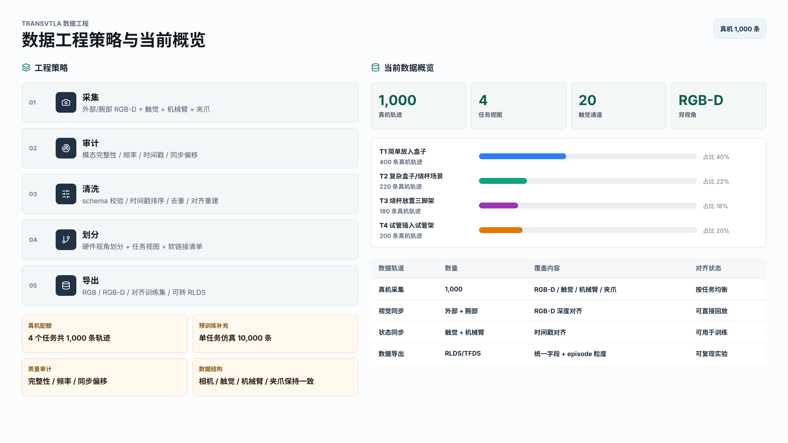
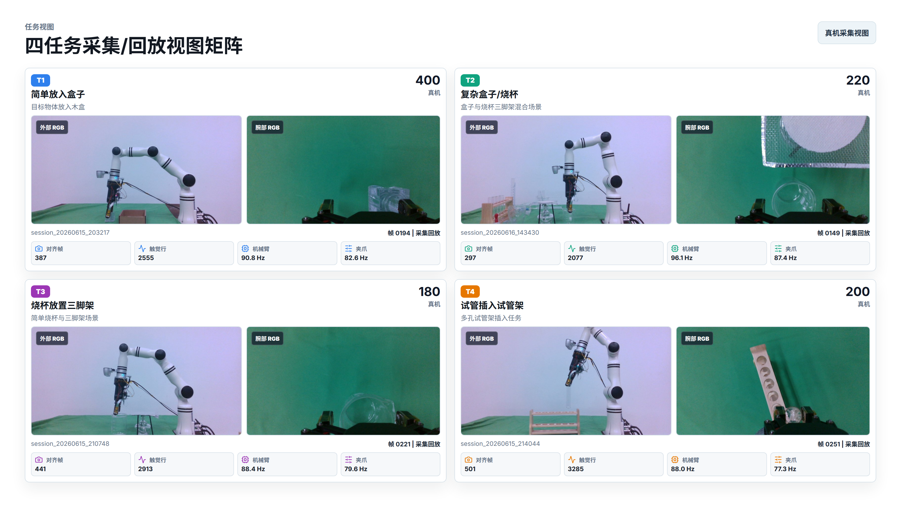

# TransVTLA-RealDataCollect

面向 **机械臂 + 双 RealSense RGB-D 相机 + 触觉/压力传感器 + 夹爪状态** 的多模态真机数据采集、清洗、回放和数据工程仓库。

## 数据工程展示





## 项目定位

本仓库把实验现场的数据采集、频率检查、离线回放、数据清洗、任务划分和 RLDS/TFDS 转换整理成一套可复用工具链。

当前数据工程展示口径：

| 数据轨道 | 数量 | 覆盖内容 | 对齐目标 |
| --- | ---: | --- | --- |
| 真机数据 | 1,000 条轨迹 | 外部/腕部 RGB-D、触觉、机械臂、夹爪 | 真实采集与回放 |
| 仿真数据 | 10,000 条轨迹 | 同任务标签、同传感器结构 | 尽量对齐真机 schema 与视角 |
| 任务视图 | 4 类任务 | 放入盒子、复杂盒子/烧杯、烧杯三脚架、试管架 | 训练与评估划分 |

四个任务的展示配额：

| 任务 | 真机轨迹 | 仿真轨迹 |
| --- | ---: | ---: |
| T1 简单放入盒子 | 400 | 4,000 |
| T2 复杂盒子/烧杯 | 220 | 2,200 |
| T3 烧杯放置三脚架 | 180 | 1,800 |
| T4 试管插入试管架 | 200 | 2,000 |

## 快速入口

### 网页 PPT

```bash
cd data-engineering-ppt
npm install
npm run react
```

访问：

- 首页：`http://localhost:5178/`
- 第二页：`http://localhost:5178/?slide=2`
- 导出模式：`http://localhost:5178/?slide=1&export=1`

已导出的高清 PNG：

- `data-engineering-ppt/exports/slide-1-data-strategy.png`
- `data-engineering-ppt/exports/slide-2-task-views.png`

### Python 环境

建议使用 Python 虚拟环境，并安装基础依赖：

```bash
pip install opencv-python numpy keyboard
pip install pyrealsense2
```

说明：

- `pyrealsense2` 需要匹配本机 RealSense 驱动和 Python 版本。
- 机械臂相关脚本依赖仓库内置的 `Robotic_Arm/` SDK。
- GUI 采集和回放脚本依赖 PySide6。

## 核心能力

- 双 RealSense RGB-D 同步采集：外部视角与腕部视角同时保存 RGB 和 depth。
- 机械臂状态采集：记录关节角度、末端位姿和软件状态。
- 夹爪状态采集：读取 RM Plus 官方状态接口，记录位置、速度、电流、力和错误码。
- 触觉/压力采集：标准化为 20 个有效触觉通道。
- 离线回放：按帧查看外部 RGB-D、腕部 RGB-D、机械臂状态、夹爪状态和触觉数据。
- 数据清洗：通道裁剪、CH58 插值、时间戳排序、夹爪去重、对齐表重建。
- 数据划分：按硬件视角和任务标签生成 manifest 与 symlink view。
- 数据导出：支持 RGB-D RLDS/TFDS 转换入口。

## 目录说明

| 路径 | 说明 |
| --- | --- |
| `collect_data.py` | 真机多模态采集主程序，包含 PySide6 采集界面 |
| `data_viwer.py` | 离线 session 回放工具 |
| `test_frequency.py` | 采集前频率检查工具 |
| `collectors/` | 相机、机械臂、夹爪、压力等采集器封装 |
| `Robotic_Arm/` | 睿尔曼机械臂 Python SDK |
| `scripts/audit_dataset.py` | 数据集审计，检查模态、频率、时间戳和同步问题 |
| `scripts/clean_dataset.py` | 数据清洗与对齐重建 |
| `scripts/materialize_split_layout.py` | 按硬件 split 生成非破坏性视图 |
| `scripts/materialize_task_splits.py` | 按任务标签生成四任务视图 |
| `scripts/build_task_preview_sheets.py` | 生成任务标注用 contact sheets |
| `Phase2_build_RLDSdata.py` | 将采集 session 转换为 RLDS/TFDS |
| `calibration/` | 相机外参、手眼标定和诊断脚本 |
| `docs/` | 数据格式、采集优化和修复计划文档 |
| `data-engineering-ppt/` | 两页数据工程网页 PPT 与高清导出图 |

## 数据结构

标准真机 session 通常形如：

```text
sessions/
  session_YYYYMMDD_HHMMSS/
    world_camera/
      rgb/
      depth/
    wrist_camera/
      rgb/
      depth/
    camera_metadata.json
    frames.csv
    aligned_timesteps.csv
    robot_state/
      robot_state.csv
      gripper_state.csv
    pressure/
      pressure.csv
```

关键模态：

- `world_camera/rgb/`：外部 RealSense RGB 图像。
- `world_camera/depth/`：外部 RealSense 深度图，`uint16 PNG`，单位毫米。
- `wrist_camera/rgb/`：腕部 RealSense RGB 图像。
- `wrist_camera/depth/`：腕部 RealSense 深度图，`uint16 PNG`，单位毫米。
- `frames.csv`：视觉帧采集时间戳。
- `aligned_timesteps.csv`：视觉、触觉、机械臂和夹爪的对齐索引。
- `camera_metadata.json`：双 RealSense 的 profile、内参、畸变、序列号和 depth scale。
- `robot_state/robot_state.csv`：机械臂关节和末端位姿。
- `robot_state/gripper_state.csv`：夹爪实时状态。
- `pressure/pressure.csv`：标准 20 通道触觉数据。

旧版 `dji/` + `realsense_rgb/` + `realsense_depth/` 会话仍可由回放、审计和转换脚本读取。

## 常用脚本

### 采集前频率检查

```bash
python test_frequency.py --sensor dual_realsense --duration 30
python test_frequency.py --sensor pressure
python test_frequency.py --sensor robot
```

### 真机多模态采集

```bash
python collect_data.py \
  --arm-host 172.25.5.243 \
  --arm-port 8080 \
  --world-serial 1234567890 \
  --wrist-serial 0987654321
```

常用参数：

- `--world-serial`：外部 RealSense 序列号。
- `--wrist-serial`：腕部 RealSense 序列号。
- `--width` / `--height`：RGB 和深度分辨率，默认 `848x480`。
- `--rs-fps`：RealSense 采集 FPS，默认 `30`。
- `--disable-gripper`：关闭夹爪状态采集。

### 离线回放

```bash
python data_viwer.py --sessions sessions
python data_viwer.py --sessions sessions --session session_20260429_120000
```

回放操作：

- 左右方向键切换帧。
- 滑块定位帧。
- `Q` 或 `ESC` 退出。

### 数据审计与清洗

```bash
python scripts/audit_dataset.py
python scripts/clean_dataset.py
python scripts/clean_dataset.py --apply
```

清洗内容包括：

- 历史 64 通道压力 CSV 裁剪为标准 20 通道。
- CH58 使用相邻通道均值插值替代。
- 非单调时间戳排序。
- 夹爪重复时间戳去重。
- dual-RealSense `aligned_timesteps.csv` 重建。

### 任务视图生成

```bash
python scripts/build_task_preview_sheets.py
python scripts/materialize_task_splits.py
```

生成结果包含：

- `dataset/task_review/previews/`
- `dataset/task_splits/task_session_manifest.csv`
- `dataset/task_splits/by_task/`
- `dataset/task_splits/by_hardware_split/`

## 推荐工作流

1. 运行 `connect_robot.py` 或 `test.py`，确认机械臂连接正常。
2. 运行 `test_frequency.py --sensor dual_realsense`，确认双 RealSense 同时工作。
3. 运行 `test_frequency.py --sensor pressure`，确认触觉数据正常。
4. 运行 `collect_data.py` 进行正式采集。
5. 采集后运行 `scripts/audit_dataset.py` 和 `scripts/clean_dataset.py`。
6. 生成任务划分和回放视图。
7. 需要训练数据时，再执行 RLDS/TFDS 转换。

## 注意事项

- 采集前固定两台 RealSense 的序列号，避免设备枚举顺序变化。
- 触觉下位机数据包需符合采集脚本约定格式。
- `dataset/`、`sessions/`、`pose_logs/`、`pressure_logs/`、`sample_output/` 等目录属于运行输出，默认不提交。
- 网页 PPT 的 `node_modules/` 和 `dist/` 不提交，只保留源码、素材和导出图。

## 许可证与说明

本仓库包含实验环境下的数据同步采集、机械臂控制和数据工程脚本。使用前请根据现场设备 IP、序列号、端口和驱动版本进行配置。
